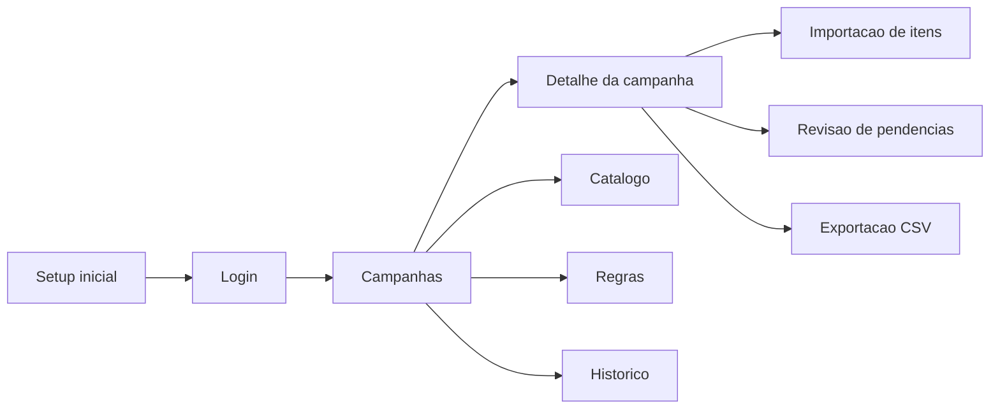
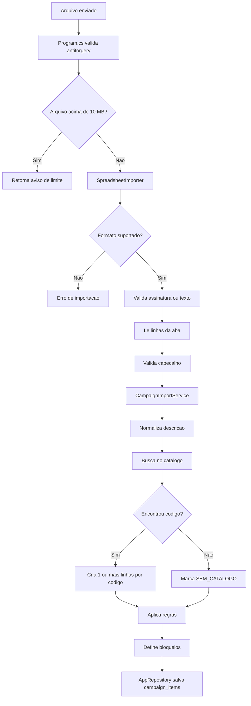
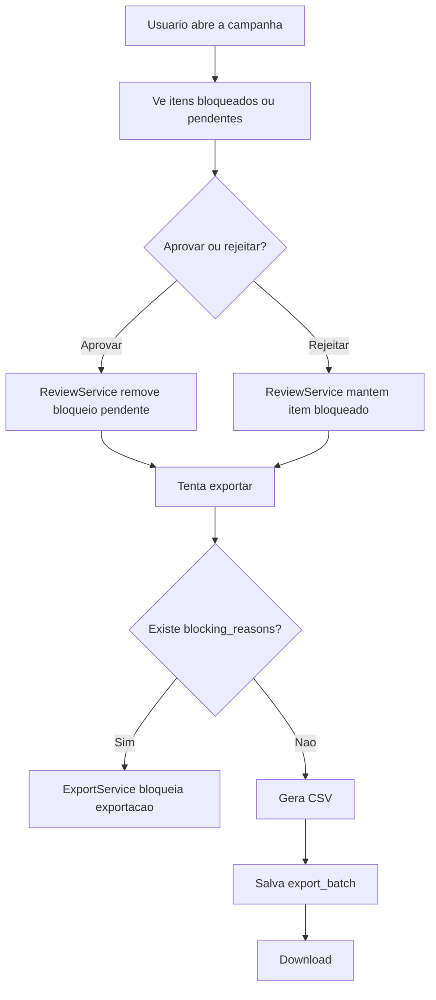
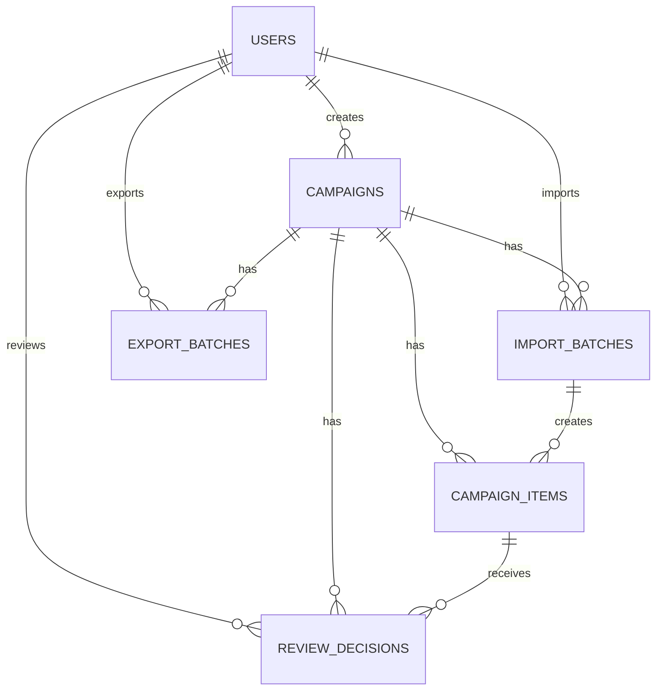

# Fluxograma e mapa do projeto

Este documento explica como o sistema funciona de ponta a ponta, o que cada parte faz e onde olhar quando surgir erro.

## Visao geral

O sistema tem 4 blocos principais:

1. `Program.cs`: recebe as requisicoes HTTP, faz login, protege formularios, chama servicos e monta as telas.
2. `Services/`: aplica a regra de negocio de importacao, revisao e exportacao.
3. `Data/`: fala com PostgreSQL, cria schema, le e grava dados.
4. `Ui/HtmlView.cs`: gera o HTML das paginas.

## Fluxo principal

```mermaid
flowchart TD
    A[Usuario abre o sistema] --> B{Existe usuario?}
    B -- Nao --> C[/setup]
    B -- Sim --> D[/login]
    C --> E[Criar primeiro administrador]
    E --> F[Salvar usuario no banco]
    F --> G[/campaigns]
    D --> H{Credenciais validas?}
    H -- Nao --> D
    H -- Sim --> G

    G --> I[Criar campanha]
    I --> J[Salvar campanha no banco]

    G --> K[Importar arquivo CSV/XLSX/XLSM]
    K --> L[Validar token antiforgery e limite do upload]
    L --> M[SpreadsheetImporter le planilha]
    M --> N[CampaignImportService normaliza dados]
    N --> O[Busca correspondencias no catalogo]
    O --> P[Aplica regras de pesaveis e fardo caixa]
    P --> Q[Gera bloqueios e pendencias]
    Q --> R[AppRepository grava campaign_items]

    R --> S[Usuario revisa itens pendentes]
    S --> T[ReviewService aprova ou rejeita]
    T --> U[Atualiza status do item]

    U --> V{Ainda existe bloqueio?}
    V -- Sim --> S
    V -- Nao --> W[Exportar CSV]
    W --> X[ExportService monta arquivo]
    X --> Y[Salvar exportacao e liberar download]
```

## Estrutura por responsabilidade

### Entrada web

- [Program.cs](</c:/Users/t.i/Projetos Git/Clube-das-Ofertas/src/ClubeDasOfertas.Web/Program.cs>)
  - Registra servicos.
  - Configura autenticacao por cookie e antiforgery.
  - Define rotas como `/setup`, `/login`, `/campaigns`, `/catalog`, `/rules`, `/history`.
  - Chama `CampaignImportService`, `ReviewService` e `ExportService`.
  - Se o erro estiver no fluxo da tela, redirecionamento ou permissao, comece aqui.

- [HtmlView.cs](</c:/Users/t.i/Projetos Git/Clube-das-Ofertas/src/ClubeDasOfertas.Web/Ui/HtmlView.cs>)
  - Monta o HTML das paginas.
  - Centraliza layout, badges e formularios.
  - Se a tela nao renderiza certo ou uma acao da barra superior sumiu, olhe aqui.

### Regra de negocio

- [SpreadsheetImporter.cs](</c:/Users/t.i/Projetos Git/Clube-das-Ofertas/src/ClubeDasOfertas.Web/Services/SpreadsheetImporter.cs>)
  - Le `CSV`, `TXT`, `XLSX` e `XLSM`.
  - Valida nome, tamanho, assinatura ZIP e conteudo de texto.
  - Procura abas e cabecalhos esperados.
  - Se o erro for "arquivo nao importa", "aba nao encontrada" ou "coluna obrigatoria ausente", comece aqui.

- [Parsing.cs](</c:/Users/t.i/Projetos Git/Clube-das-Ofertas/src/ClubeDasOfertas.Web/Services/Parsing.cs>)
  - Converte preco, quantidade, unidade e tipo de codigo.
  - Se um valor monetario, `Kg`, `Fardos` ou `EAN` vier errado, olhe aqui.

- [TextNormalizer.cs](</c:/Users/t.i/Projetos Git/Clube-das-Ofertas/src/ClubeDasOfertas.Web/Services/TextNormalizer.cs>)
  - Remove acento e padroniza chaves de busca.
  - Se o cruzamento com o catalogo falhar por diferenca textual, este arquivo entra na investigacao.

- [CampaignImportService.cs](</c:/Users/t.i/Projetos Git/Clube-das-Ofertas/src/ClubeDasOfertas.Web/Services/CampaignImportService.cs>)
  - Orquestra a importacao da campanha.
  - Busca itens no catalogo.
  - Aplica regras de pesavel e fardo caixa.
  - Gera bloqueios como `Produto sem catalogo/codigo`, `Conversao de pesavel pendente`, `Fardo/caixa pendente`.
  - Se o erro for "o item entrou bloqueado errado" ou "a regra de conversao nao bateu", este e o primeiro arquivo.

- [ReviewService.cs](</c:/Users/t.i/Projetos Git/Clube-das-Ofertas/src/ClubeDasOfertas.Web/Services/ReviewService.cs>)
  - Aprova ou rejeita revisao manual.
  - Remove bloqueios pendentes quando o item e aprovado.
  - Se o item nao sai do estado pendente ou rejeitado, olhe aqui.

- [ExportService.cs](</c:/Users/t.i/Projetos Git/Clube-das-Ofertas/src/ClubeDasOfertas.Web/Services/ExportService.cs>)
  - Verifica se ainda existe bloqueio.
  - Gera o CSV final.
  - Salva o historico da exportacao.
  - Se o erro for "nao exporta" ou "o CSV saiu errado", comece aqui.

### Persistencia e banco

- [AppDb.cs](</c:/Users/t.i/Projetos Git/Clube-das-Ofertas/src/ClubeDasOfertas.Web/Data/AppDb.cs>)
  - Abre conexao com PostgreSQL.
  - Completa a senha usando `ConnectionStrings:PostgreSqlPassword`, `POSTGRESQL_PASSWORD` ou `POSTGRES_PASSWORD`.
  - Normaliza `localhost` para `127.0.0.1` na configuracao padrao para evitar falha quando o PostgreSQL local escuta so em IPv4.
  - Se a conexao falhar, a excecao passa a orientar explicitamente a subir o banco local e carregar as variaveis do `.env` no processo atual.
  - Se houver erro de conexao ou de configuracao de senha, este e o ponto base.

- [SchemaInitializer.cs](</c:/Users/t.i/Projetos Git/Clube-das-Ofertas/src/ClubeDasOfertas.Web/Data/SchemaInitializer.cs>)
  - Cria tabelas na inicializacao.
  - Cria usuarios bootstrap somente quando a configuracao existir.
  - Cria regras padrao.
  - Se o sistema sobe mas faltam tabelas, regras ou seed inicial, olhe aqui.

- [AppRepository.cs](</c:/Users/t.i/Projetos Git/Clube-das-Ofertas/src/ClubeDasOfertas.Web/Data/AppRepository.cs>)
  - Faz todo o SQL de leitura e escrita.
  - Campaigns, catalogo, regras, itens, revisoes, exportacoes e auditoria passam por aqui.
  - Se o erro for "gravou errado no banco", "consulta nao trouxe item" ou "nao salvou exportacao", este e o arquivo principal.

- [PasswordHasher.cs](</c:/Users/t.i/Projetos Git/Clube-das-Ofertas/src/ClubeDasOfertas.Web/Data/PasswordHasher.cs>)
  - Gera e valida hash de senha.
  - Se o login falhar sem motivo aparente, confira este arquivo junto com `Program.cs`.

### Modelos

- [Models.cs](</c:/Users/t.i/Projetos Git/Clube-das-Ofertas/src/ClubeDasOfertas.Web/Domain/Models.cs>)
  - Define entidades como `Campaign`, `CampaignItem`, `ProductCatalogEntry`, `ConversionRule`, `ExportBatch`.
  - Se precisar adicionar campo novo no sistema, normalmente o primeiro passo e aqui.

## Fluxo por tela



## Fluxo de importacao



## Fluxo de revisao e exportacao



## Banco de dados

Tabelas principais:

- `users`: login e perfil.
- `product_catalog_entries`: base de descricao, Solidus e codigo.
- `conversion_rules`: regras editaveis.
- `campaigns`: cabecalho da campanha.
- `import_batches`: registro de cada importacao.
- `campaign_items`: itens finais processados.
- `review_decisions`: aprovacoes e rejeicoes.
- `export_batches`: arquivos exportados.
- `audit_logs`: historico operacional.

Relacao simplificada:



## Onde mexer quando algo der erro

### 1. Erro de setup ou login

Olhar nesta ordem:

- [Program.cs](</c:/Users/t.i/Projetos Git/Clube-das-Ofertas/src/ClubeDasOfertas.Web/Program.cs>): rotas `/setup`, `/login` e `/logout`
- [AppRepository.cs](</c:/Users/t.i/Projetos Git/Clube-das-Ofertas/src/ClubeDasOfertas.Web/Data/AppRepository.cs>): `GetUserByEmailAsync`, `CreateUserAsync`, `HasUsersAsync`
- [PasswordHasher.cs](</c:/Users/t.i/Projetos Git/Clube-das-Ofertas/src/ClubeDasOfertas.Web/Data/PasswordHasher.cs>)
- [SchemaInitializer.cs](</c:/Users/t.i/Projetos Git/Clube-das-Ofertas/src/ClubeDasOfertas.Web/Data/SchemaInitializer.cs>): seed bootstrap

### 2. Banco nao conecta ou sistema nao sobe

Olhar nesta ordem:

- [appsettings.json](</c:/Users/t.i/Projetos Git/Clube-das-Ofertas/src/ClubeDasOfertas.Web/appsettings.json>)
- [AppDb.cs](</c:/Users/t.i/Projetos Git/Clube-das-Ofertas/src/ClubeDasOfertas.Web/Data/AppDb.cs>)
- [SchemaInitializer.cs](</c:/Users/t.i/Projetos Git/Clube-das-Ofertas/src/ClubeDasOfertas.Web/Data/SchemaInitializer.cs>)
- `app-run.out.log` e `app-run.err.log` na raiz do projeto

### 3. Erro de token ou formulario expirado

Olhar nesta ordem:

- [Program.cs](</c:/Users/t.i/Projetos Git/Clube-das-Ofertas/src/ClubeDasOfertas.Web/Program.cs>): `AddAntiforgery`, `UseAntiforgery`, `AntiForgeryField`
- [HtmlView.cs](</c:/Users/t.i/Projetos Git/Clube-das-Ofertas/src/ClubeDasOfertas.Web/Ui/HtmlView.cs>): formularios da navegacao e layout

Sinais comuns:

- pagina aberta ha muito tempo antes do envio;
- usuario fez login em outra aba;
- formulario foi reaproveitado sem recarregar a pagina.

### 4. Arquivo nao importa

Olhar nesta ordem:

- [SpreadsheetImporter.cs](</c:/Users/t.i/Projetos Git/Clube-das-Ofertas/src/ClubeDasOfertas.Web/Services/SpreadsheetImporter.cs>)
- [Parsing.cs](</c:/Users/t.i/Projetos Git/Clube-das-Ofertas/src/ClubeDasOfertas.Web/Services/Parsing.cs>)
- [Program.cs](</c:/Users/t.i/Projetos Git/Clube-das-Ofertas/src/ClubeDasOfertas.Web/Program.cs>): rotas `/campaigns/{id}/import` e `/catalog/import`

Sinais comuns:

- "Arquivo acima do limite": upload maior que `10 MB`.
- "Arquivo invalido": assinatura ZIP ou texto nao bate com o formato.
- "Aba nao encontrada": nome esperado no importador nao bate com a planilha.
- "Coluna obrigatoria ausente": cabecalho veio diferente.
- "Preco invalido": parser nao conseguiu entender o valor.

### 5. Item nao cruzou com o catalogo

Olhar nesta ordem:

- [TextNormalizer.cs](</c:/Users/t.i/Projetos Git/Clube-das-Ofertas/src/ClubeDasOfertas.Web/Services/TextNormalizer.cs>)
- [CampaignImportService.cs](</c:/Users/t.i/Projetos Git/Clube-das-Ofertas/src/ClubeDasOfertas.Web/Services/CampaignImportService.cs>)
- [AppRepository.cs](</c:/Users/t.i/Projetos Git/Clube-das-Ofertas/src/ClubeDasOfertas.Web/Data/AppRepository.cs>): `FindCatalogMatchesAsync`
- tabela `product_catalog_entries`

### 6. Conversao de preco saiu errada

Olhar nesta ordem:

- [CampaignImportService.cs](</c:/Users/t.i/Projetos Git/Clube-das-Ofertas/src/ClubeDasOfertas.Web/Services/CampaignImportService.cs>)
- [Parsing.cs](</c:/Users/t.i/Projetos Git/Clube-das-Ofertas/src/ClubeDasOfertas.Web/Services/Parsing.cs>)
- [SchemaInitializer.cs](</c:/Users/t.i/Projetos Git/Clube-das-Ofertas/src/ClubeDasOfertas.Web/Data/SchemaInitializer.cs>): regras padrao
- tela `/rules` (criar, editar e alternar)

Casos tipicos:

- pesavel multiplicou quando nao devia;
- item `Kg` nao deveria virar `x10`;
- fardo ou caixa deveria ir para revisao e nao foi.

### 7. Item fica pendente para sempre

Olhar nesta ordem:

- [ReviewService.cs](</c:/Users/t.i/Projetos Git/Clube-das-Ofertas/src/ClubeDasOfertas.Web/Services/ReviewService.cs>)
- [AppRepository.cs](</c:/Users/t.i/Projetos Git/Clube-das-Ofertas/src/ClubeDasOfertas.Web/Data/AppRepository.cs>): `UpdateItemReviewAsync`
- tabela `campaign_items`, campo `blocking_reasons`

### 8. Exportacao nao libera

Olhar nesta ordem:

- [ExportService.cs](</c:/Users/t.i/Projetos Git/Clube-das-Ofertas/src/ClubeDasOfertas.Web/Services/ExportService.cs>)
- [Program.cs](</c:/Users/t.i/Projetos Git/Clube-das-Ofertas/src/ClubeDasOfertas.Web/Program.cs>): rota `POST /campaigns/{id}/export`
- [AppRepository.cs](</c:/Users/t.i/Projetos Git/Clube-das-Ofertas/src/ClubeDasOfertas.Web/Data/AppRepository.cs>): leitura dos itens
- tabela `campaign_items`: conferir `blocking_reasons`

### 9. CSV final saiu com formato errado

Olhar nesta ordem:

- [ExportService.cs](</c:/Users/t.i/Projetos Git/Clube-das-Ofertas/src/ClubeDasOfertas.Web/Services/ExportService.cs>)
- [TextNormalizer.cs](</c:/Users/t.i/Projetos Git/Clube-das-Ofertas/src/ClubeDasOfertas.Web/Services/TextNormalizer.cs>): escape do CSV
- [Parsing.cs](</c:/Users/t.i/Projetos Git/Clube-das-Ofertas/src/ClubeDasOfertas.Web/Services/Parsing.cs>): formato monetario e datas

## Ordem segura para mexer

Quando precisar alterar o sistema, a ordem mais segura costuma ser:

1. Ajustar ou adicionar campos em [Models.cs](</c:/Users/t.i/Projetos Git/Clube-das-Ofertas/src/ClubeDasOfertas.Web/Domain/Models.cs>)
2. Ajustar schema ou SQL em [SchemaInitializer.cs](</c:/Users/t.i/Projetos Git/Clube-das-Ofertas/src/ClubeDasOfertas.Web/Data/SchemaInitializer.cs>) e [AppRepository.cs](</c:/Users/t.i/Projetos Git/Clube-das-Ofertas/src/ClubeDasOfertas.Web/Data/AppRepository.cs>)
3. Ajustar regra de negocio em `Services/`
4. Ajustar rota ou fluxo em [Program.cs](</c:/Users/t.i/Projetos Git/Clube-das-Ofertas/src/ClubeDasOfertas.Web/Program.cs>)
5. Ajustar tela em [HtmlView.cs](</c:/Users/t.i/Projetos Git/Clube-das-Ofertas/src/ClubeDasOfertas.Web/Ui/HtmlView.cs>)
6. Validar com [tests/Program.cs](</c:/Users/t.i/Projetos Git/Clube-das-Ofertas/tests/ClubeDasOfertas.Tests/Program.cs>)

## Testes atuais

- [tests/Program.cs](</c:/Users/t.i/Projetos Git/Clube-das-Ofertas/tests/ClubeDasOfertas.Tests/Program.cs>)
  - valida parser monetario;
  - valida parser de quantidade;
  - valida normalizacao de texto;
  - valida leitura real da planilha `.xlsm`;
  - valida conversao de pesaveis;
  - valida deteccao de fardo e caixa;
  - valida duplicidade por codigo;
  - valida rejeicao de uploads invalidos.

Se surgir bug novo de regra de negocio, o melhor caminho e acrescentar teste aqui antes de corrigir a implementacao.
